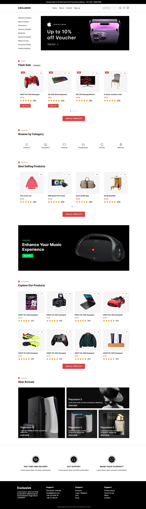

# P-1-E-Commerce-Website-main

I'm going to show you how to use modern HTML and CSS to create a completely responsive E-Commerce Website with awesome color theme. We'll be using CSS Flexbox, Media queries for our responsive design and CSS transition for some cool animation effects.

# Screenshot
Here we have project screenshot :

